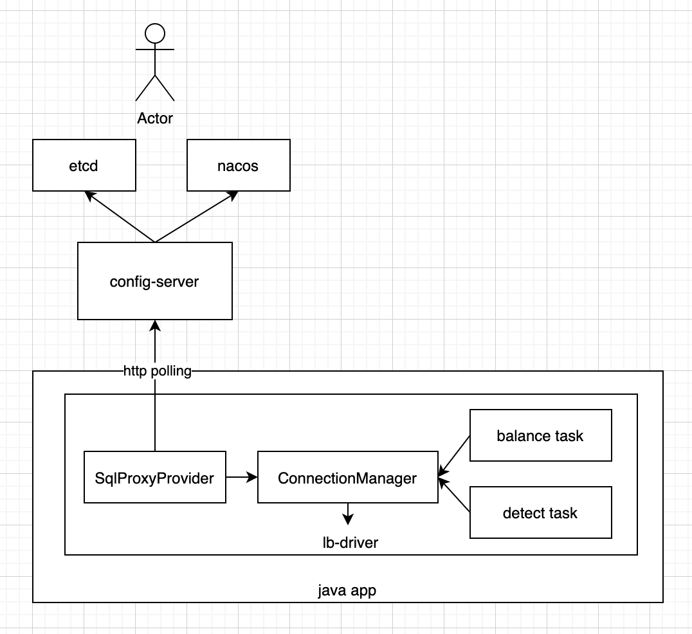

# lb-driver

Load-Balance-Driver, wrapper of mysql-jdbc-driver, suitable for use in databases with proxy architecture, such as OceanBase, TiDB, etc.


## 简介

* 参考了网易内部分库分表中间件DDB的LBDriver的代码，但是重写了代码，从而适配更一般的场景
* 适用于需要业务直连sql-proxy，而非通过负载均衡器（nlb/slb），使得负载均衡的逻辑从nlb/slb下沉到driver层
* 优点是使得sql-proxy的负载更均衡，且通过减少网络链路，降低rt，避免负载均衡器（nlb/slb）成为性能瓶颈
* driver会自动探活并屏蔽故障sql-proxy，自动均衡到各个sql-proxy的连接数
* 在对接config-server的模式下，可以不重启业务进程，做到快速上下线sql-proxy
* 仅依赖slf4j-api和mysql-connector-java，没有其他依赖
* 适用于oceanbase、tidb等

## 架构



## 使用方式

### 引入

```xml
<dependency>
    <groupId>com.netease.nim</groupId>
    <artifactId>lb-driver</artifactId>
    <version>1.0.0</version>
</dependency>
```
```
driver=com.netease.nim.lbd.LBDriver
```

### 本地模式

* 地址串配置的sql-proxy的节点列表，lb-driver直接从地址串中获取完整的sql-proxy节点列表，lb-driver会自动剔除不可用的sql-proxy节点

地址串示例：
```
jdbc:mysql:lb:local://10.189.0.1:6000,10.189.0.2:6000,10.189.0.3:6000/mydatabase?connectTimeout=5000&socketTimeout=10000&logStats=true
```

* `logStats` 表示是否打印统计日志，可选，默认false
* `checkBalanceIntervalSeconds` 负载均衡定时任务的间隔，可选，默认10s
* `checkHealthIntervalSeconds` 健康检查定时任务的间隔，可选，默认5s
* `unsupportedMethodBehavior` 调用不支持方法时的行为，`throwException` 或者 `ignoreCall`，可选，默认 `throwException`
* `exceptionSorter` 哪些异常需要重建连接到判断函数，配置全类名，需要实现 `ExceptionSorter` 接口，默认是 `com.netease.nim.lbd.MySqlExceptionSorter`


### config-server模式

* 地址串配置的是config-server的地址，lb-driver从config-server动态获取sql-proxy节点列表，从而可以不重启业务做sql-proxy的扩缩容
* config-server是无状态服务，可以部署多个节点，挂在nginx/nlb后端，达到集群高可用

地址串示例：
```
jdbc:mysql:lb:remote://config-server.xxx.com:8080/mydatabase?connectTimeout=5000&socketTimeout=10000&configServerApiKey=xxx&configServerSchema=im_user&logStats=true
```

* `config-server.xxx.com:8080` 表示config-server的地址，需要host:port的格式，如果是443端口，则走https，否则，走http，必填
* `configServerApiKey` 表示config-server的鉴权key，可选，取决于config-server是否开启了鉴权
* `configServerSchema` 表示config-server的schema，必填
* `configServerTimeout` 表示访问config-server的超时，单位毫秒，可选，默认5000
* `logStats` 表示是否打印统计日志，可选，默认false
* `checkBalanceIntervalSeconds` 负载均衡定时任务的间隔，可选，默认10s
* `checkHealthIntervalSeconds` 健康检查定时任务的间隔，可选，默认5s
* `unsupportedMethodBehavior` 调用不支持方法时的行为，`throwException` 或者 `ignoreCall`，可选，默认 `throwException`
* `exceptionSorter` 哪些异常需要重建连接，配置全类名，需要实现 `ExceptionSorter` 接口，默认是 `com.netease.nim.lbd.MySqlExceptionSorter`

config-server的部署配置，参考：[config_server](doc/config_server.md)


## 测试用例

参考：[test_case](doc/test_case.md)


## 示例代码

参考：[example](lb-driver-example)

## 更新日志

参考：[更新日志](update.md)