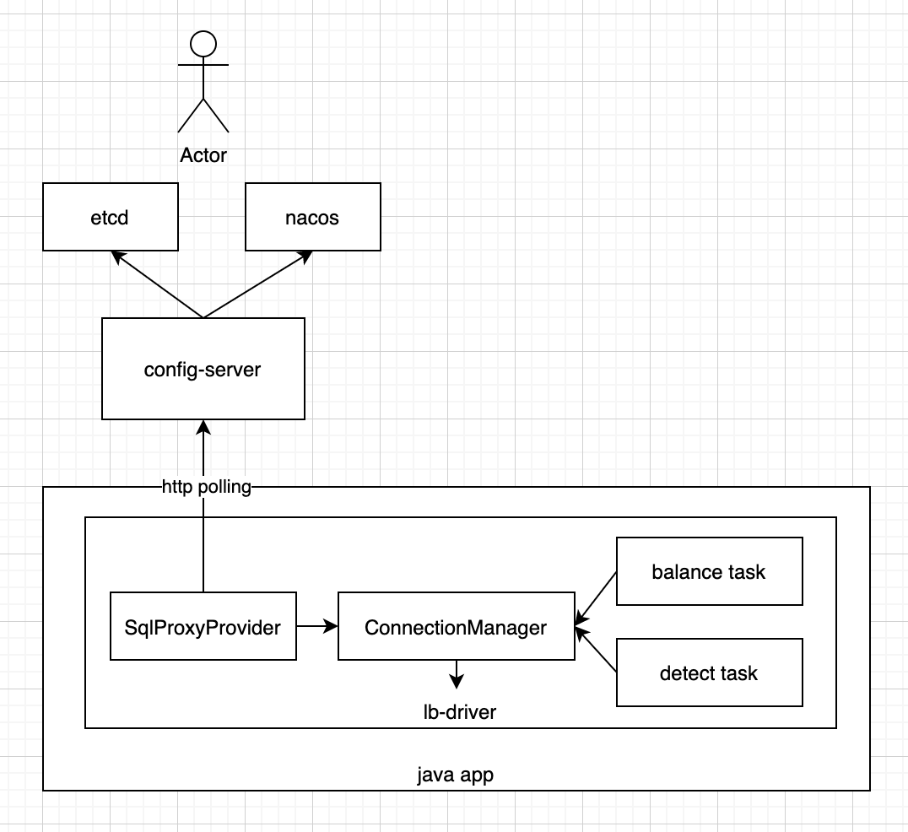

# lb-driver

Load-Balance-Driver, wrapper of mysql-jdbc-driver, suitable for use in databases with proxy architecture, such as OceanBase, TiDB, etc.


[](https://github.com/netease-im/lb-driver/releases)


English | [简体中文](README.md)

## Introduction

* This project references the LBDriver implementation from NetEase's internal DDB sharding middleware, but the code has been rewritten to support more general scenarios.
* It is suitable for scenarios where applications need to connect directly to sql-proxy instead of through a load balancer such as NLB or SLB, moving the load-balancing logic from the NLB/SLB layer down into the driver layer.
* This helps distribute sql-proxy load more evenly, reduces RT by shortening the network path, and prevents load balancers such as NLB or SLB from becoming performance bottlenecks.
* The driver automatically performs health detection, shields failed sql-proxy nodes, and balances the number of connections across sql-proxy nodes.
* When integrated with config-server, sql-proxy nodes can be brought online or offline quickly without restarting the application process.
* It depends only on slf4j-api and mysql-connector-java, with no other dependencies.
* It is suitable for OceanBase, TiDB, and similar databases.

## Architecture



## Usage

### Dependency

```xml
<dependency>
    <groupId>com.netease.nim</groupId>
    <artifactId>lb-driver</artifactId>
    <version>1.0.0</version>
</dependency>
```
```
driver=com.netease.nim.lbd.LBDriver
```

### Local Mode

* The connection URL contains the sql-proxy node list. lb-driver obtains the complete sql-proxy node list directly from the URL and automatically removes unavailable sql-proxy nodes.

Connection URL example:
```
jdbc:mysql:lb:local://10.189.0.1:6000,10.189.0.2:6000,10.189.0.3:6000/mydatabase?connectTimeout=5000&socketTimeout=10000&logStats=true
```

* `logStats` specifies whether to print statistics logs. Optional. The default is false.
* `checkBalanceIntervalSeconds` specifies the interval of the scheduled load-balancing task. Optional. The default is 10s.
* `checkHealthIntervalSeconds` specifies the interval of the scheduled health-check task. Optional. The default is 5s.
* `unsupportedMethodBehavior` specifies the behavior when an unsupported method is called: `throwException` or `ignoreCall`. Optional. The default is `throwException`.
* `exceptionSorter` specifies which exceptions require connection recreation. Configure the fully qualified class name of a class that implements the `ExceptionSorter` interface. The default is `com.netease.nim.lbd.MySqlExceptionSorter`.


### Config-Server Mode

* The connection URL contains the config-server address. lb-driver dynamically obtains the sql-proxy node list from config-server, so sql-proxy scaling can be performed without restarting the application.
* config-server is a stateless service. Multiple nodes can be deployed behind nginx or NLB to provide high availability.

Connection URL example:
```
jdbc:mysql:lb:remote://config-server.xxx.com:8080/mydatabase?connectTimeout=5000&socketTimeout=10000&configServerApiKey=xxx&configServerSchema=im_user&logStats=true
```

* `config-server.xxx.com:8080` is the config-server address. It must use the host:port format. Port 443 uses HTTPS; all other ports use HTTP. Required.
* `configServerApiKey` is the authentication key for config-server. Optional, depending on whether config-server authentication is enabled.
* `configServerSchema` is the schema configured in config-server. Required.
* `configServerTimeout` specifies the timeout for accessing config-server, in milliseconds. Optional. The default is 5000.
* `logStats` specifies whether to print statistics logs. Optional. The default is false.
* `checkBalanceIntervalSeconds` specifies the interval of the scheduled load-balancing task. Optional. The default is 10s.
* `checkHealthIntervalSeconds` specifies the interval of the scheduled health-check task. Optional. The default is 5s.
* `unsupportedMethodBehavior` specifies the behavior when an unsupported method is called: `throwException` or `ignoreCall`. Optional. The default is `throwException`.
* `exceptionSorter` specifies which exceptions require connection recreation. Configure the fully qualified class name of a class that implements the `ExceptionSorter` interface. The default is `com.netease.nim.lbd.MySqlExceptionSorter`.

For config-server deployment configuration, see [config_server](doc/config_server_EN.md).


## Test Cases

See [test_case](doc/test_case_EN.md).


## Example Code

See [example](lb-driver-example).

## Changelog

See [changelog](update_EN.md).

## Blog Post

[NetEase open-sources lb-driver: Driver-layer load balancing practice for OceanBase OBProxy](https://open.oceanbase.com/blog/27234102304)

## Related Links

[OceanBase](https://github.com/oceanbase/oceanbase)
[TiDB](https://github.com/pingcap/tidb)
